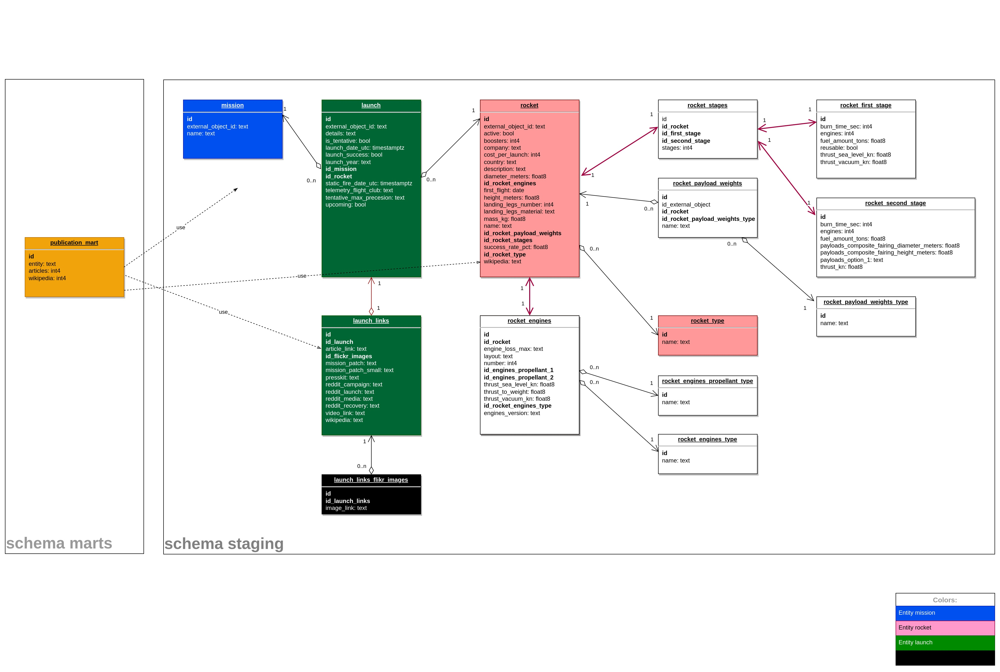
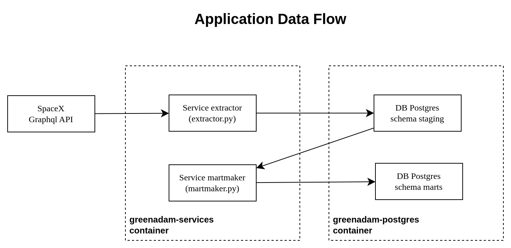

# This is a solution for the challenge 

Challenge by greenatom.ru.

# Task 1

## Problem

https://docs.google.com/document/d/1HSSnsVXZ0pigNSo9aFerq5sFD7BvWsxp/edit

## Solution

[Solution is in the directory task_1](task_1/README.md)

# Task 2

## Preface

Нам очень интересно посмотреть на твои скиллы в моделировании данных, Python, 
Docker, и RDBMS. Поэтому мы решили дать тебе типичную DE задачу, но при этом 
очень интересную - поработать над интеграцией на данных Space X 🚀

## Problem

https://docs.google.com/document/d/10Hc8UN-vwCFa-6gO-8Lra1HUCkA6JteV/edit


Задача:
1. Написать сервис/скрипт, который загружает данные из GraphQL API 
    (https://studio.apollographql.com/public/SpaceX-pxxbxen/home) в базу 
    данных Postgres.
2. Спроектировать модель данных с витринами данных. Например тут (https://www.diagrams.net/).
3. Написать сервис/скрипт, который наполняет спроектированные таблицы.
4. Создать витрину данных, которая подсчитывает количество публикаций по миссиям,  
    ракетам и пускам (missions, rockets and launches).
5. Написать Dockerfile и docker-compose.yml, которые позволят нам запустить 
    твой код и делать запросы к БД ( docker compose up -d )
6. Залить проект на GitHub и поделиться с нами ссылкой на него (сделать публичным). 
    А также ссылкой на модель данных.


## Solution

- Designed and implemented 2 services:
   - extractor: 
     - Gathers data from SpaceX GraphQL API
     - Stores data in Postgres DB schema `staging`
   - martmaker:
     - Gathers data from Postgres DB schema `staging`
     - Makes a Data Mart `publication` and stores it in schema `marts`
- Designed Data Model with Data Marts:
  - [Data Model (drawio)](doc/Data_Model.drawio) 
  - [Data Model (jpg)](doc/Data_Model.jpg)
- Project published on github: https://github.com/pr0xtti/greenadam


Application can be started with docker compose.
Docker compose will run this hierarchy:

```
greenadam-services (container, will be build)
    supervisord
        extractor.sh
            ./collective/extractor.py
        martmaker.sh
            ./collective/martmaker.py

greenadam-postgres (container postgres)
    postgres
```

All python source located in folder collective.
Supervisord runs in nodaemon mode and outputs from services to stdout and stderr.

### Configuration

| File                   | Desctiption                                                                     |
|------------------------|---------------------------------------------------------------------------------|
| vars.env               | Credentials and variables for Postgres and API url. Used in docker-compose.yaml |
| docker-compose.yaml    | External port for Postgres is here                                              |
| Dockerfile             | Configuration to build greenadam-services container                             |
| supervisord.conf       | Configuration for supervisor                                                    |
| collective/config.yaml | Configuration for the application: sleep timeout.                               |
| collective/logging.py  | Configuration for the application logging. Use DEBUG for debug mode.            |

### Install

Download and start with docker compose:

```shell
clone https://github.com/pr0xtti/greenadam.git && \
cd greenadam && \
docker compose up -d
```

It will start two containers:

```shell
rin@lab-1:~/dev/greenadam/greenadam$ docker ps | egrep '^CONT|greenadam'
CONTAINER ID   IMAGE            COMMAND                  CREATED         STATUS         PORTS                                         NAMES
a9063a5d0ad7   greenadam-svc   "/usr/bin/supervisord"   3 minutes ago   Up 3 minutes                                                 greenadam-services
039d31e97b4d   postgres         "docker-entrypoint.s…"   3 minutes ago   Up 3 minutes   0.0.0.0:55400->5432/tcp, :::55400->5432/tcp   greenadam-postgres
rin@lab-1:~/dev/greenadam/greenadam$ 
```

View logs in container:

```shell
# Like tail -f
docker logs greenadam-services -f 2>&1

# All with less
docker logs greenadam-services -n all 2>&1 | less
```


### Project structure

```
.
├── collective                        # Python source code root
│   ├── core                          # module for application configuration
│   │   ├── config.py
│   │   └── tool.py
│   ├── db
│   │   ├── mart                      # module for martmaker
│   │   │   ├── base_class.py         # Base class for martmaker SQL Alchemy models
│   │   │   └── database.py           # Some db functions for martmaker
│   │   ├── models                    # SQL Alchemy models for DB
│   │   │   ├── launch.py
│   │   │   ├── mission.py
│   │   │   ├── publication.py
│   │   │   └── rocket.py
│   │   ├── repository                # module to work with entities and DB
│   │   │   ├── entity_base.py        # Base class for entities
│   │   │   ├── launch.py
│   │   │   ├── mission.py
│   │   │   ├── publication.py
│   │   │   └── rocket.py
│   │   ├── base_class.py             # Base class for SQL Alchemy models
│   │   ├── database.py
│   │   └── session.py
│   ├── service                       # module for business logic
│   │   ├── common.py
│   │   └── mart.py
│   ├── sxapi                         # module for working with SpaceX GraphQL API
│   │   ├── base.py
│   │   ├── launch.py
│   │   ├── mission.py
│   │   ├── rocket.py
│   │   └── session.py
│   ├── config.yaml                   # Application config
│   ├── extractor.py                  # Runs extractor service
│   ├── logging.yaml                  # Logging configuration
│   ├── martmaker.py                  # Runs martmaker service
│   └── requirements.txt
├── doc                               # Schemes
│   ├── Data_Model.drawio             # Schema: Data Model
│   ├── Application_Data_Flow.drawio  # Schema: Application data flow                       
├── docker-compose.yaml               # Docker compose configuration to run all
├── Dockerfile                        # Build config for greenadam-services container
├── extractor.sh                      # Starts extractor.py, runs from supervisord
├── martmaker.sh                      # Starts marketmaker.py, runs from supervisord 
├── README.md                         # This README
└── supervisord.conf                  # Config for supervisord

```

### Data Model



### Application data flow

[Application Data Flow (drawio)](doc/Application_Data_Flow.drawio)



### Problems

I wasn't able to get some data from SpaceX GraphQL API.
Sometimes it (Query in Explorer) just returns `null`.
For example, I didn't understand how to link ships with launches or with rockets. 

So my goal was to show my skill building application, but not to examine all SpaceX data.
