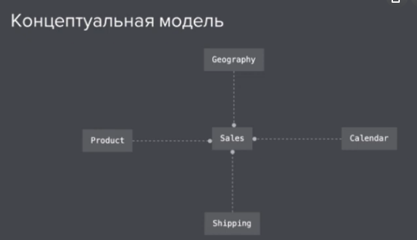
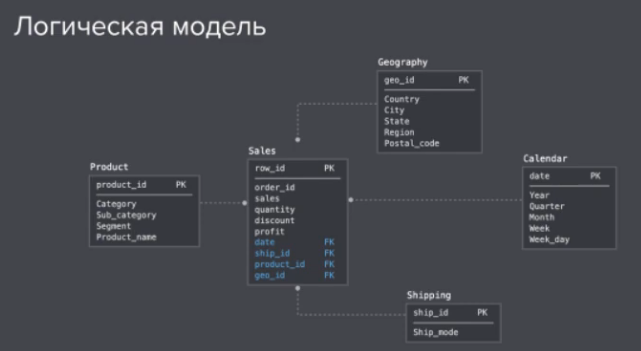
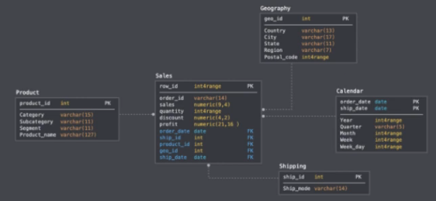

# Storages

- Data Warehouse
    Structured data, easier to use than in DL.
- Data Lake
    Unstructured, unmodified data. 
- Data Mart
    Small amount. Categorized. Schemes: star, snowflake, vault.

# Data Model

- Star, Dimensional Modelling
- 3NF
- Data Vault
    Hubs, Links, Satellites

# Schemes

- Star
- Snowflake

# DB type

- DWH - Data Warehouse
- OLTP - Online Transaction Processing System

# Storage Layers

Layers = schemes

- Staging - raw data from different systems.
- Corporation Data Model: Data Vault, Inman
- Business Layer: Data Marts

# Steps to design Data Model.

- Conceptual Model

- Logical Model

- Physical Model (DDL - Data Definition Language)

Naming convention:

Dimension:

    calendar_dim

Staging

Dimensional tables - reference tables

# Data Mart

## Types

- Dependent

- Independent

- Hybrid

